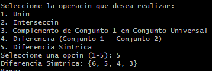

# Operaciones de DMSet

## Descripción general del proyecto

Este proyecto implementa una estructura de datos de `Set` adaptado a una implementación de `Abstract Data Type` en Python, lo que permite a los usuarios realizar varias operaciones de conjunto, como **unión**, **intersección**, **complemento**, **diferencia** y **diferencia simétrica**. La implementación evita el uso del tipo `Set` integrado de Python y proporciona funcionalidades de conjunto básicas a través de una estructura de lista enlazada. El proyecto está diseñado para cumplir con los principios de programación orientada a objetos y `Clean Code` en Python.

## Enfoque del problema

### Estructuras de datos utilizadas

- **Nodo**: una clase que representa un solo elemento del conjunto. Cada nodo contiene un `valor` y un puntero `("next")` al siguiente nodo.
- **DMSet**: una clase que representa el conjunto personalizado. Esta clase incluye métodos para `agregar`, `eliminar` y `verificar` la presencia de elementos, así como para realizar operaciones de conjunto como unión, intersección y diferencia.

### Operaciones clave

1. **Unión**: combina elementos de dos conjuntos.
2. **Intersección**: recupera solo los elementos presentes en ambos conjuntos.
3. **Complemento**: busca elementos en el conjunto universal que no están presentes en el conjunto actual.
4. **Diferencia**: recupera elementos que están en un conjunto pero no en otro.
5. **Diferencia simétrica**: combina elementos de ambos conjuntos, excluyendo la intersección.

### Detalles de implementación

- **Validación de entrada**: garantiza que solo se agreguen caracteres válidos `(A-Z, 0-9)` a los conjuntos.
- **Robustez**: el programa incluye controles para entradas no válidas y las maneja con elegancia con mensajes informativos.

## Instalación y requisitos previos

### Requisitos previos

- Python 3.x instalado en su sistema.

### Instalación

1. **Clonar el repositorio**

```bash
git clone https://github.com/lfmendoza/discrete-math.git
cd discrete-math
```

2. **Ejecutar el programa**

El programa no requiere ninguna dependencia adicional. Simplemente ejecute el script `main.py` con Python:

```bash
python main.py
```

## Cómo utilizar el programa

### Instrucciones paso a paso

1. **Menú Principal**

Al ejecutar el programa, se le presentará el siguiente menú:

```
Menu:
1. Construir conjuntos
2. Operar conjuntos
3. Finalizar
```

2. **Construir Conjuntos**

- Elige la opción `1` para construir dos conjuntos.
- Ingresa los elementos para cada conjunto utilizando solo caracteres `A-Z` y dígitos `0-9`.
- El programa asegurará que solo se acepten caracteres válidos.

3. **Operar Conjuntos**

- Elige la opción `2` para realizar operaciones en los dos conjuntos que construiste.
- Se te pedirá que selecciones entre las siguientes operaciones:

```
1. Complemento
2. Unión
3. Intersección
4. Diferencia
5. Diferencia Simétrica
```

- Después de seleccionar una operación, se mostrará el resultado.

4. **Finalizar**

- Elige la opción `3` para salir del programa.

### Ejemplos de Salidas

- **Unión** de `{1, 2, 3}` y `{3, 4, 5}` resulta en `{1, 2, 3, 4, 5}`.
- **Intersección** de `{1, 2, 3}` y `{3, 4, 5}` resulta en `{3}`.
- **Complemento** de `{1, 2, 3}` en el conjunto universal `{1, 2, 3, 4, 5}` resulta en `{4, 5}`.
- **Diferencia** de `{1, 2, 3}` y `{3, 4, 5}` resulta en `{1, 2}`.
- **Diferencia Simétrica** de `{1, 2, 3}` y `{3, 4, 5}` resulta en `{1, 2, 4, 5}`.

### Capturas de Pantalla de la Ejecución del Programa

#### Construyendo conjuntos


#### Unión


### Intersección


#### Complemento


#### Diferencia


#### Diferencia Simétrica


